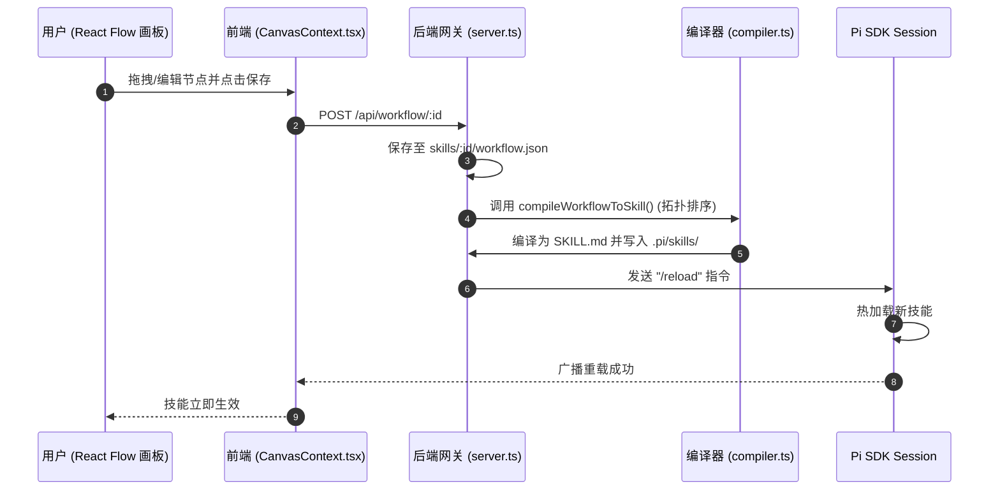
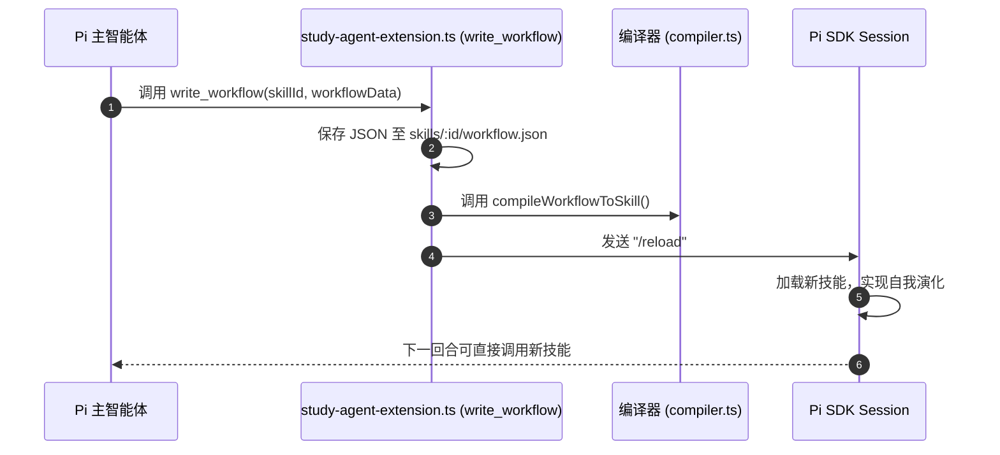
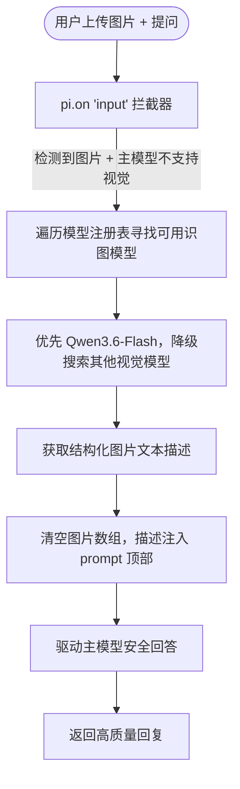

# projectEL - 基于 Pi Agent 内核的辅助学习智能体系统

[](https://opensource.org/licenses/MIT)
[](https://nodejs.org/)
[](https://reactjs.org/)

`projectEL` 是一款专为**开发者与终身学习者**打造的智能辅助学习系统。它基于 **Pi Agent** 开发套件，深度融合了"苏格拉底教学智能体"、可视化低代码工作流画板（React Flow），并实现了创新的**双轨遗忘曲线**常青记忆知识库体系。

---

## 架构设计

项目采用 **Monorepo** 单体多包架构管理，包含 React 前端卡片式 Web 界面、Node.js Express 统一后端网关，以及本地打包的 `pi-sdk` 内核组件。

### 目录结构

```
projectEL/
├── backend/                          # Node.js Express 后端网关服务
│   └── src/
│       ├── server.ts                 # WebSocket/HTTP 网关，多会话管理、Pi Session 生命周期
│       ├── compiler.ts               # 工作流 JSON → SKILL.md 编译器 (拓扑排序)
│       ├── study-agent-extension.ts  # Pi Agent 扩展：预设 System Prompt 注入、Qwen 识图拦截器、write_workflow 工具
│       └── knowledge-base/           # 知识库后端模块
│           ├── types.ts              # Wiki 卡片 / 笔记 / 归档类型定义
│           ├── knowledge-base-service.ts  # 核心服务 (CRUD / 指数衰减 / SM-2 / 归档 Veto)
│           └── knowledge-routes.ts   # REST 路由 (16 个端点)
├── frontend/                         # Vite + React + TypeScript + React Flow 前端 UI
│   └── src/
│       ├── App.tsx                   # 主应用入口 (Context Provider 嵌套 + 卡片路由)
│       ├── contexts/                 # React Context 全局状态管理层
│       │   ├── ChatContext.tsx       # 聊天消息流 / Socket.io 通信 / 多会话切换
│       │   ├── CanvasContext.tsx     # React Flow 画布节点/边状态管理
│       │   └── WorkspaceContext.tsx  # 多卡片布局 / 抽屉面板状态
│       ├── components/
│       │   ├── ChatCard.tsx          # AI 对话卡片 (流式渲染 / 图片上传)
│       │   ├── CanvasCard.tsx        # 工作流画布卡片 (React Flow 可视化编辑器)
│       │   ├── KnowledgeCard/        # 知识库卡片组件集
│       │   │   ├── KnowledgeCard.tsx     # 主组件 (Wiki/笔记视图路由)
│       │   │   ├── WikiDetailView.tsx    # Wiki 卡片详情与编辑
│       │   │   ├── WikiFormView.tsx      # 创建/编辑表单
│       │   │   ├── ArchiveReview.tsx     # 归档审查 (Lint + Veto + 链接重写)
│       │   │   └── ConfidenceBadge.tsx   # 置信度徽章 (绿/黄/红/灰)
│       │   ├── Sidebar.tsx           # 侧边导航栏 (卡片切换 / 会话管理 / 预设选择)
│       │   ├── Workspace.tsx         # 多卡片工作区 (拖拽分栏 / 大小调整)
│       │   ├── SlideDrawer.tsx       # 全局滑出抽屉
│       │   └── SettingsPanel.tsx     # 模型与 API 凭证配置面板
│       └── hooks/
│           └── useKnowledgeBase.ts   # 知识库 API 请求 Hook
├── wiki_core/                        # Layer 3: LLM 动态知识网 (Markdown)
│   ├── concepts/                     #   常青/标准概念
│   ├── temporary/                    #   快速衰减知识
│   └── archive/                      #   归档 (置信度 < 0.15)
├── curated_notes/                    # Layer 2: 人类整理笔记 (SM-2 间隔重复)
├── inbox/                            # 暂存区 + archive_review.md
├── sources/                          # Layer 1: 外部参考源材料
├── pi-sdk/                           # 本地 Pi Agent 内核开发套件 (workspace 包)
│   └── packages/
│       ├── agent/                    # @earendil-works/pi-agent
│       ├── ai/                       # @earendil-works/pi-ai
│       └── coding-agent/             # @earendil-works/pi-coding-agent
├── skills/                           # 智能体预设 & 工作流定义
│   └── agent-presets.json            # 预设配置 (苏格拉底导师 / 代码专家)
├── .pi/                              # Pi 内核运行时数据
│   ├── skills/                       # 编译后的 SKILL.md 技能文件
│   ├── extensions/                   # 扩展脚本 (server 启动时自动复制)
│   ├── agent/sessions/               # 会话持久化 (JSONL)
│   ├── auth.json                     # API 密钥持久化存储
│   └── models.json                   # 模型注册表 & Provider 配置
├── docs/                             # 设计文档
│   ├── plan—develop.md               # 开发进度与规划
│   ├── webui.md                      # WebUI 设计规范
│   ├── knowledge_base_architecture_v2.md  # 知识库架构白皮书
│   └── learning_agent_architecture.md     # 智能体编排架构
├── start.bat                         # Windows 一键启动脚本
├── package.json                      # 根配置与 workspaces
└── tsconfig.base.json                # 共享 TypeScript 配置
```

### 前端状态管理架构

```
App.tsx
  └─ <ChatProvider>          # Socket.io 连接、消息流、多会话管理
       └─ <WorkspaceProvider>  # 卡片布局、抽屉面板、拖拽分栏
            └─ <CanvasProvider> # React Flow 节点/边状态、工作流编译
                 └─ <MainLayout>
                      ├─ Sidebar       (导航 / 会话列表 / 预设切换)
                      ├─ Workspace     (多卡片拖拽容器)
                      │   ├─ ChatCard
                      │   ├─ CanvasCard
                      │   └─ KnowledgeCard
                      └─ SlideDrawer   (SettingsPanel)
```

---

## 双环编译与热重载

支持**用户端（画板可视化配置）**与**智能体端（Agent 自我演化）**的双向技能重塑机制，核心编译逻辑位于 `backend/src/compiler.ts`。

### A环：用户低代码画板编译流



### B环：智能体自我修饰流



---

## Qwen 识图子智能体协作流

`backend/src/study-agent-extension.ts` 中实现的多模态拦截器：用户上传图片且当前主模型不支持视觉输入时，自动调用 Qwen-VL 等多模态模型提取图像描述，注入主模型 prompt。



---

## 功能特性

| 模块 | 功能 | 状态 | 代码位置 |
|:---|:---|:---:|:---|
| **基础框架** | Monorepo workspaces 管理 | ✅ 已完成 | `package.json` |
| | start.bat 一键启动 (含 API Key 扫描) | ✅ 已完成 | `start.bat` |
| **前端 WebUI** | 卡片式多窗口拖拽布局 (Workspace) | ✅ 已完成 | `Workspace.tsx`, `WorkspaceContext.tsx` |
| | 苏格拉底流式交互聊天 (Socket.io) | ✅ 已完成 | `ChatCard.tsx`, `ChatContext.tsx` |
| | 多会话创建/切换/删除 | ✅ 已完成 | `ChatContext.tsx`, `server.ts` |
| | 智能体预设 (苏格拉底导师 / 代码专家) | ✅ 已完成 | `agent-presets.json`, `Sidebar.tsx` |
| | 模型选择与 API 凭证配置 | ✅ 已完成 | `SettingsPanel.tsx` |
| **Pi 工作流** | React Flow 可视化画板 | ✅ 已完成 | `CanvasCard.tsx`, `CanvasContext.tsx` |
| | workflow.json → SKILL.md 编译器 (拓扑排序) | ✅ 已完成 | `compiler.ts` |
| | write_workflow 自我修改与热重载 | ✅ 已完成 | `study-agent-extension.ts` |
| **多模态** | Qwen-VL 识图拦截与 prompt 增强 | ✅ 已完成 | `study-agent-extension.ts` |
| **双轨知识库** | 指数衰减置信度引擎 C(t)=C₀e^(-λt) | ✅ 已完成 | `knowledge-base-service.ts` |
| | Layer 3 Wiki 卡片 CRUD (概念/临时/归档) | ✅ 已完成 | `knowledge-base-service.ts` |
| | SM-2 间隔重复笔记复习 | ✅ 已完成 | `knowledge-base-service.ts` |
| | 归档审查 (Lint + Veto + 链接重写) | ✅ 已完成 | `ArchiveReview.tsx` |
| | REST API + Socket.io 实时同步 | ✅ 已完成 | `knowledge-routes.ts` |
| | 置信度徽章 (绿/黄/红/灰) | ✅ 已完成 | `ConfidenceBadge.tsx` |
| **QQ Bot** | NapCat QQ 框架适配 | ❌ 待开发 | — |

---

## 项目文档

项目的所有设计、架构及开发文档已整理至 [docs/](./docs/) 目录下：

* **[开发者与进度指南 (plan—develop.md)](./docs/plan—develop.md)**：记录了当前开发进度、技术栈、双轨知识库机制及下一步开发指引。
* **[WebUI 设计与方向规划白皮书 (webui.md)](./docs/webui.md)**：包含系统的视觉设计规范（2D 粒子拓扑图谱）及开发迁移阶段。
* **[智能融合知识库架构白皮书 (knowledge_base_architecture_v2.md)](./docs/knowledge_base_architecture_v2.md)**：描述了时间维度的遗忘曲线算法、指数衰减模型、SM-2 间隔重复及归档审查 Veto 机制。
* **[智能体内核与编排架构设计 (learning_agent_architecture.md)](./docs/learning_agent_architecture.md)**：详细拆解了 React Flow 低代码画布与 Pi SDK 编译热重载的闭环机制。

---

## 快速开始

### 环境要求

- Node.js >= 18.0.0
- npm >= 9.0.0

### 安装与启动

```bash
# 安装所有依赖
npm install

# 一键启动前后端
npm run dev
# 后端 → http://localhost:3000
# 前端 → http://localhost:5173
```

如果前端能打开，但设置面板提示“无法连接后端模型服务”，通常是后端 `3000` 没有成功监听。此时建议使用双终端方式启动，便于分别观察日志：

```bash
# 终端 1：启动后端
npm run dev:backend
# 看到 Server running at http://localhost:3000 后保持该终端运行
```

```bash
# 终端 2：启动前端
npm run dev:frontend
# 打开 http://localhost:5173
```

启动后请确认：
- 后端接口 `http://localhost:3000/api/models?sessionId=default-session` 可以返回模型配置
- 前端地址 `http://localhost:5173` 可以打开
- 聊天功能需要后端终端持续运行，仅打开前端页面并不代表 Agent 已连接

Windows 下也可直接双击 `start.bat`，脚本会自动扫描环境变量和 `.pi/auth.json` 中的 API Key 配置状态。

### 配置 API 密钥与模型

项目支持以下模型服务商，在 Web 界面左下角 ⚙️ 齿轮按钮中配置：

| 服务商 | 环境变量 | Base URL | 模型示例 |
|:---|:---|:---|:---|
| **DeepSeek** | `DEEPSEEK_API_KEY` | `https://api.deepseek.com` | DeepSeek V4 Pro / Flash |
| **Qwen (DashScope)** | `DASHSCOPE_API_KEY` | `https://dashscope.aliyuncs.com/compatible-mode/v1` | Qwen3.6 Plus / Flash / Max |
| **Anthropic** | `ANTHROPIC_API_KEY` | `https://api.anthropic.com` | Claude Opus 4.7 / Sonnet 4.6 / Haiku 4.5 |
| **OpenAI** | `OPENAI_API_KEY` | `https://api.openai.com/v1` | GPT-5.4 / GPT-5.4 Mini / GPT-4.1 |
| **Google** | `GOOGLE_API_KEY` | `https://generativelanguage.googleapis.com/v1beta` | Gemini 3.1 Pro / 2.5 Pro / 2.5 Flash |
| **OpenRouter** | `OPENROUTER_API_KEY` | `https://openrouter.ai/api/v1` | Claude / GPT / Gemini (聚合) |

配置方式有两种：
- **Web 界面**：启动后点击左下角 ⚙️ 齿轮按钮，填入 API Key / Base URL，点击"保存并生效"，自动持久化到 `.pi/auth.json` 和 `.pi/models.json`
- **环境变量**：设置上表对应的环境变量，服务启动时自动加载

### 配置 Qwen API（重要）

使用 Qwen（通义千问）模型需要通过阿里云百炼平台获取 API Key：

1. 访问 [阿里云百炼平台](https://bailian.console.aliyun.com/) 开通 DashScope 服务
2. 在 **业务空间 → 模型广场** 中，手动开启你需要使用的模型授权（如 qwen3.6-plus、qwen3.6-flash 等），新开通的百炼账号默认不启用所有模型
3. 获取 API Key：百炼控制台右上角 → API-KEY 管理 → 创建 AccessKey
4. 在 projectEL 的 ⚙️ 设置面板中找到 **QWEN**，填入 API Key，点击"填官方参数"自动填入 Base URL，保存即可

> **注意**：仅获取 API Key 不足以调用所有模型，必须在百炼平台业务空间中**逐模型开启授权**，否则 API 会返回模型未开通的错误。识图功能建议启用 `qwen3.6-flash` 或 `qwen-plus-latest` 等多模态模型。

---

## API 端点

### 会话管理 (Sessions)

| 方法 | 路径 | 说明 |
|------|------|------|
| GET | `/api/sessions` | 列出所有会话 |
| POST | `/api/sessions/create` | 创建新会话 (可选 presetId) |
| POST | `/api/sessions/switch` | 切换到指定会话 |
| DELETE | `/api/sessions/:id` | 删除会话 (不可删除 default-session) |

### 智能体预设 (Agent Presets)

| 方法 | 路径 | 说明 |
|------|------|------|
| GET | `/api/agents` | 获取所有预设 |
| POST | `/api/agents` | 创建预设 |
| PUT | `/api/agents/:id` | 更新预设 |
| DELETE | `/api/agents/:id` | 删除预设 |

### 模型管理 (Models)

| 方法 | 路径 | 说明 |
|------|------|------|
| GET | `/api/models?sessionId=` | 获取所有模型 / Provider 状态 / 激活模型 |
| POST | `/api/models/configure` | 配置 Provider (API Key / Base URL / 自定义模型) |
| POST | `/api/models/select` | 切换激活模型与思考等级 |

### 工作流 (Workflow)

| 方法 | 路径 | 说明 |
|------|------|------|
| GET | `/api/workflow/:id` | 获取技能的可视化工作流 JSON |
| POST | `/api/workflow/:id` | 保存并编译工作流 → SKILL.md + 热重载 |

### 知识库 (Knowledge Base)

| 方法 | 路径 | 说明 |
|------|------|------|
| GET | `/api/knowledge/cards` | 列出所有 Wiki 卡片 |
| GET | `/api/knowledge/cards/search?q=` | 搜索卡片 |
| GET | `/api/knowledge/cards/:id` | 获取单张卡片 |
| POST | `/api/knowledge/cards` | 创建卡片 |
| PUT | `/api/knowledge/cards/:id` | 更新卡片 |
| DELETE | `/api/knowledge/cards/:id` | 删除卡片 |
| POST | `/api/knowledge/cards/:id/boost` | 提升置信度 +0.2 |
| GET | `/api/knowledge/notes` | 列出笔记 |
| POST | `/api/knowledge/notes` | 创建笔记 |
| PUT | `/api/knowledge/notes/:id` | 更新笔记 |
| POST | `/api/knowledge/notes/:id/review` | SM-2 复习 (grade 0-4) |
| GET | `/api/knowledge/archive/list` | 列出已归档卡片 |
| GET | `/api/knowledge/archive/review` | 获取归档预告清单 |
| POST | `/api/knowledge/archive/lint` | 扫描低置信度卡片 |
| POST | `/api/knowledge/archive/execute` | 执行归档 |
| GET | `/api/knowledge/stats` | 统计数据 |

### WebSocket 事件 (Socket.io)

客户端通过 Socket.io 连接 `http://localhost:3000` 进行实时双向通信：

| 事件 (客户端→服务端) | 说明 |
|:---|:---|
| `join-session` | 加入指定会话房间，接收该会话的消息流 |
| `leave-session` | 离开会话房间 |
| `send-message` | 发送用户消息 (支持文本 + 图片) |
| `abort` | 中断当前 AI 生成 |
| `clear-session` | 清空对话历史 |

| 事件 (服务端→客户端) | 说明 |
|:---|:---|
| `session-state` | 会话状态同步 (消息历史 / 模型 / 思考等级) |
| `pi-event` | Pi Agent 流式事件 (agent_start / message_start / message_update / message_end / tool_execution_*) |
| `pi-error` | Pi 内核错误通知 |

---

## 知识库架构（V2 遗忘曲线）

系统采用双轨遗忘曲线设计：

### Layer 3: LLM 动态编译知识网

使用指数衰减模型：**有效置信度 = C₀ × e^(-λ × t)**

| 生命周期 | 衰减率 λ | 半衰期 | 行为 |
|----------|----------|--------|------|
| `immortal` | 0 | ∞ | 永不衰减 |
| `standard` | 0.0038 | ~180 天 | 标准衰减 |
| `decay_fast` | 0.0495 | ~14 天 | 快速衰减 |

- 置信度 < 0.15 → 进入归档候选
- Boost 操作 +0.2，上限 1.0
- 归档时自动重写 `[[链接]]` 为 `**名称[已归档]**`

### Layer 2: 人类整理笔记

使用 SM-2 间隔重复算法：
- Grade ≥ 3: 稳定性递增（1 → 6 → 自定义），难度递减
- Grade < 3: 重置稳定性，难度递增
- 下次复习时间 = 当前时间 + 稳定性 × 1 天

---

## 智能体预设系统

`skills/agent-presets.json` 中预置了两个智能体角色：

| 预设 ID | 名称 | 默认模型 | 思考等级 | 描述 |
|:---|:---|:---|:---:|:---|
| `socrates` | 苏格拉底导师 | DeepSeek V4 Flash | High | 通过追问启发思考，不直接给答案 |
| `coder` | 代码专家 | DeepSeek V4 Pro | X-High | 高质量代码、架构设计与安全审查 |

预设支持自定义 System Prompt、绑定知识库上下文文档 (contextDocs)、关联技能工作流 (linkedSkills)。在侧边栏中可一键创建带预设的新会话。

---

## Roadmap

- [ ] **QQ Bot 适配**: NapCat QQ 框架 WebSocket 连接，支持 Quiz 卡片推送与答题反馈
