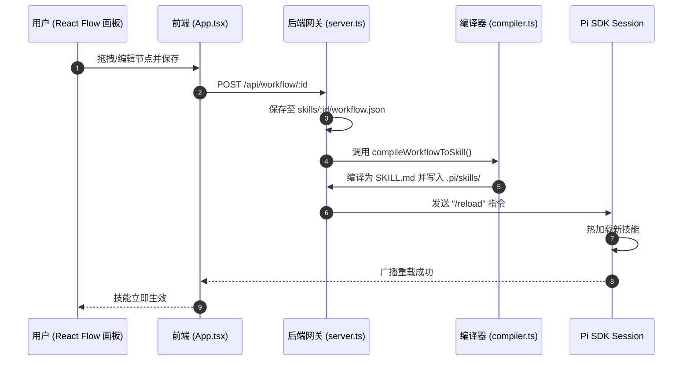
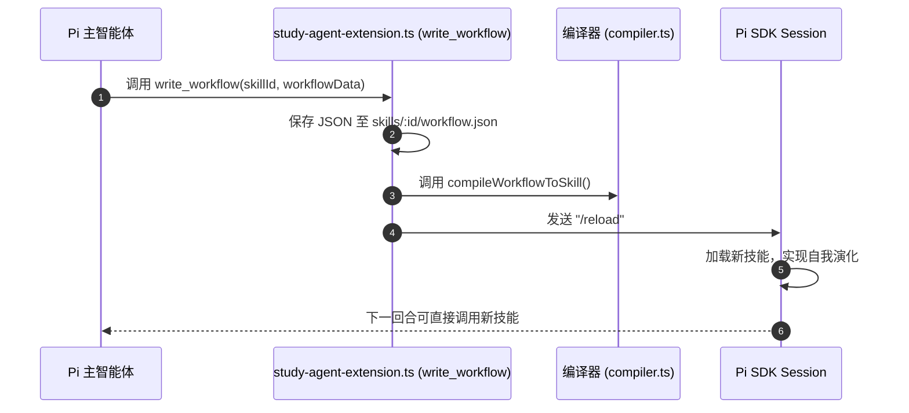
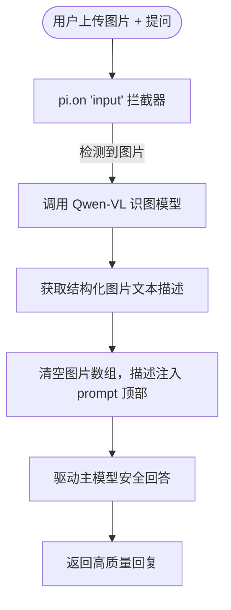

# 🚀 projectEL - 基于 Pi Agent 内核的辅助学习智能体系统

[](https://opensource.org/licenses/MIT)
[](https://nodejs.org/)
[](https://reactjs.org/)

`projectEL` 是一款专为**开发者与终身学习者**打造的智能辅助学习系统。它基于 **Pi Agent** 开发套件，深度融合了"苏格拉底教学智能体"、可视化低代码工作流画板（Dify-style Canvas），并实现了创新的**双轨遗忘曲线**常青记忆知识库体系。

---

## 🗺️ 架构设计

项目采用 **Monorepo** 单体多包架构管理，包含前端卡片式 Web 界面、Node.js 统一后端网关，以及本地打包的 `pi-sdk` 内核组件。

### 目录结构

```
projectEL/
├── backend/                       # Node.js Express 后端网关服务
│   └── src/
│       ├── server.ts              # WebSocket/HTTP 网关，Pi Session 驱动与生命周期
│       ├── compiler.ts            # 工作流 JSON → SKILL.md 编译器
│       ├── study-agent-extension.ts # Pi Agent 自定义工具扩展与输入拦截器
│       └── knowledge-base/        # 知识库后端模块
│           ├── types.ts                  # 数据类型定义
│           ├── knowledge-base-service.ts # 核心服务 (CRUD / 置信度衰减 / SM-2 / 归档)
│           └── knowledge-routes.ts       # REST 路由 (15 个端点)
├── frontend/                      # Vite + React + TypeScript + React Flow 前端 UI
│   └── src/
│       ├── App.tsx                # 主应用 (卡片路由 / Socket.io 消息管道)
│       ├── components/
│       │   ├── ChatCard.tsx       # AI 对话卡片
│       │   ├── CanvasCard.tsx     # 工作流画布卡片 (React Flow)
│       │   ├── KnowledgeCard/     # 知识库卡片组件集
│       │   │   ├── KnowledgeCard.tsx    # 主组件 (视图路由)
│       │   │   ├── WikiDetailView.tsx   # 卡片详情
│       │   │   ├── WikiFormView.tsx     # 创建/编辑表单
│       │   │   ├── ArchiveReview.tsx    # 归档审查
│       │   │   └── ConfidenceBadge.tsx  # 置信度徽章
│       │   ├── Sidebar.tsx        # 侧边导航栏
│       │   ├── Workspace.tsx      # 多卡片工作区 (拖拽/分栏)
│       │   ├── SlideDrawer.tsx    # 滑出抽屉
│       │   └── SettingsPanel.tsx  # 模型配置面板
│       ├── hooks/
│       │   └── useKnowledgeBase.ts # 知识库 API Hook
│       └── main.tsx
├── wiki_core/                     # Layer 3: LLM 知识网 (自动生成)
│   ├── concepts/                  #   常青/标准概念
│   ├── temporary/                 #   快速衰减知识
│   └── archive/                   #   归档 (置信度 < 0.15)
├── curated_notes/                 # Layer 2: 人类整理笔记 (SM-2 间隔重复)
├── inbox/                         # 暂存区 + archive_review.md
├── pi-sdk/                        # 本地 Pi Agent 内核开发套件
├── skills/                        # 用户/Agent 创建的低代码工作流 (.json)
├── start.bat                      # Windows 一键启动脚本
└── package.json                   # 根配置与 workspaces
```

---

## 🔄 双环编译与热重载

支持**用户端（画板可视化配置）**与**智能体端（Agent 自我演化）**的双向技能重塑机制，核心编译逻辑位于 `backend/src/compiler.ts`。

### A环：用户低代码画板编译流



### B环：智能体自我修饰流



---

## 🧠 Qwen 识图子智能体协作流

`backend/src/study-agent-extension.ts` 中实现的多模态拦截器：用户上传图片时，自动调用 Qwen-VL 模型提取图像描述，注入主模型 prompt。



---

## 📋 功能特性

| 模块 | 功能 | 状态 | 代码位置 |
|:---|:---|:---:|:---|
| **基础框架** | Monorepo workspaces 管理 | ✅ 已完成 | `package.json` |
| | start.bat 一键启动 | ✅ 已完成 | `start.bat` |
| **前端 WebUI** | 卡片式多窗口拖拽布局 (Workspace) | ✅ 已完成 | `App.tsx`, `Workspace.tsx` |
| | 苏格拉底流式交互聊天 | ✅ 已完成 | `ChatCard.tsx` |
| | 模型选择与 API 密钥配置 | ✅ 已完成 | `SettingsPanel.tsx` |
| **Pi 工作流** | React Flow 可视化画板 | ✅ 已完成 | `CanvasCard.tsx` |
| | workflow.json → SKILL.md 编译器 | ✅ 已完成 | `compiler.ts` |
| | write_workflow 自我修改与热重载 | ✅ 已完成 | `study-agent-extension.ts` |
| **多模态** | Qwen-VL 识图拦截与 prompt 增强 | ✅ 已完成 | `study-agent-extension.ts` |
| **双轨知识库** | 指数衰减置信度引擎 C(t)=C₀e^(-λt) | ✅ 已完成 | `knowledge-base-service.ts` |
| | Layer 3 Wiki 卡片 CRUD (概念/临时/归档) | ✅ 已完成 | `knowledge-base-service.ts` |
| | SM-2 间隔重复笔记复习 | ✅ 已完成 | `knowledge-base-service.ts` |
| | 归档审查 (Lint + Veto + 链接重写) | ✅ 已完成 | `ArchiveReview.tsx` |
| | REST API + Socket.io 实时同步 | ✅ 已完成 | `knowledge-routes.ts` |
| | 置信度徽章 (绿/黄/红/灰) | ✅ 已完成 | `ConfidenceBadge.tsx` |
| **QQ Bot** | NapCat QQ 框架适配 | ❌ 待开发 | — |

---

## 📂 项目文档 (Documentation)

项目的所有设计、架构及开发文档已整理至 [docs/](file:///c:/Users/lisky/Desktop/projectEL/docs/) 目录下：

*   **[开发者与进度指南 (develop.md)](file:///c:/Users/lisky/Desktop/projectEL/docs/develop.md)**：记录了当前开发进度、技术栈、双轨知识库机制及下一步开发指引。
*   **[WebUI 设计与方向规划白皮书 (webui.md)](file:///c:/Users/lisky/Desktop/projectEL/docs/webui.md)**：包含系统的视觉设计规范（2D 粒子拓扑图谱）及开发迁移阶段。
*   **[智能融合知识库架构白皮书 (knowledge_base_architecture_v2.md)](file:///c:/Users/lisky/Desktop/projectEL/docs/knowledge_base_architecture_v2.md)**：描述了时间维度的遗忘曲线算法、指数衰减模型、SM-2 间隔重复及归档审查 Veto 机制。
*   **[智能体内核与编排架构设计 (learning_agent_architecture.md)](file:///c:/Users/lisky/Desktop/projectEL/docs/learning_agent_architecture.md)**：详细拆解了 React Flow 低代码画布与 Pi SDK 编译热重载的闭环机制。

---

## 🛠️ 快速开始

### 环境要求

- Node.js >= 18.0.0
- npm >= 9.0.0

### 安装与启动

```bash
# 安装所有依赖
npm install

# 一键启动前后端
npm run dev
# 后端 → http://localhost:3000
# 前端 → http://localhost:5173
```

Windows 下也可直接双击 `start.bat`。

### 配置 API 密钥

两种方式：
- **Web 界面**：启动后点击左下角 ⚙️ 齿轮按钮，填入 API Key / Base URL，自动持久化到 `.pi/auth.json`
- **环境变量**：`DEEPSEEK_API_KEY` / `DASHSCOPE_API_KEY` / `ANTHROPIC_API_KEY` / `OPENAI_API_KEY` / `OPENROUTER_API_KEY`

---

## 📡 API 端点

### 知识库 (Knowledge Base)

| 方法 | 路径 | 说明 |
|------|------|------|
| GET | `/api/knowledge/cards` | 列出所有 Wiki 卡片 |
| GET | `/api/knowledge/cards/search?q=` | 搜索卡片 |
| GET | `/api/knowledge/cards/:id` | 获取单张卡片 |
| POST | `/api/knowledge/cards` | 创建卡片 |
| PUT | `/api/knowledge/cards/:id` | 更新卡片 |
| DELETE | `/api/knowledge/cards/:id` | 删除卡片 |
| POST | `/api/knowledge/cards/:id/boost` | 提升置信度 +0.2 |
| GET | `/api/knowledge/notes` | 列出笔记 |
| POST | `/api/knowledge/notes` | 创建笔记 |
| PUT | `/api/knowledge/notes/:id` | 更新笔记 |
| POST | `/api/knowledge/notes/:id/review` | SM-2 复习 (grade 0-4) |
| GET | `/api/knowledge/archive/list` | 列出已归档卡片 |
| GET | `/api/knowledge/archive/review` | 获取归档预告清单 |
| POST | `/api/knowledge/archive/lint` | 扫描低置信度卡片 |
| POST | `/api/knowledge/archive/execute` | 执行归档 |
| GET | `/api/knowledge/stats` | 统计数据 |

---

## 🧠 知识库架构（V2 遗忘曲线）

系统采用双轨遗忘曲线设计：

### Layer 3: LLM 动态编译知识网

使用指数衰减模型：**有效置信度 = C₀ × e^(-λ × t)**

| 生命周期 | 衰减率 λ | 半衰期 | 行为 |
|----------|----------|--------|------|
| `immortal` | 0 | ∞ | 永不衰减 |
| `standard` | 0.0038 | ~180 天 | 标准衰减 |
| `decay_fast` | 0.0495 | ~14 天 | 快速衰减 |

- 置信度 < 0.15 → 进入归档候选
- Boost 操作 +0.2，上限 1.0
- 归档时自动重写 `[[链接]]` 为 `**名称[已归档]**`

### Layer 2: 人类整理笔记

使用 SM-2 间隔重复算法：
- Grade ≥ 3: 稳定性递增（1 → 6 → 自定义），难度递减
- Grade < 3: 重置稳定性，难度递增
- 下次复习时间 = 当前时间 + 稳定性 × 1 天

---

## 📅 Roadmap

- [ ] **QQ Bot 适配**: NapCat QQ 框架 WebSocket 连接，支持 Quiz 卡片推送与答题反馈
