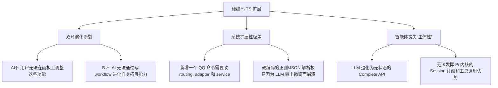

# projectEL 架构分析报告：拓展模块与 Skill 机制融合度评估

本报告针对 `projectEL` 当前的系统架构进行深度剖析，重点评估 **QQ Bot、测验系统 (Quiz)、聊天提炼器 (Chat Refiner)、识图 (Vision) 子智能体**等拓展模块在实现上是否存在“没有利用 Skill 机制而导致架构过度僵硬”的问题，并提出针对性的重构建议。

---

## 1. 核心结论

**是的，目前的拓展模块确实存在严重的“去智能体化”和“硬编码僵硬”问题。**

虽然 `projectEL` 基于 `Pi Agent` SDK 构建，并且设计了“双环编译与热重载”机制（A环：用户画布编译；B环：Agent自我修改），但目前大部分增量拓展模块（如 QQ 机器人周报、Quiz 测验、群聊提炼）都被实现成了**传统 Node.js 后端服务**。这些服务将 LLM 仅仅当成一个“无状态的文本生成/翻译 API”（即普通的 Complete 接口），而没有将其深度融入 `Pi SDK` 的 **Skill (技能描述手册)**、**Tool (动态注册工具)** 和 **Sub-Agent (子代理会话)** 体系中。

这导致了系统在可配置性、自我演化（B环失效）以及用户低代码编排（A环失效）上面临巨大的局限。

---

## 2. 僵硬性问题典型案例深剖

### 2.1 案例 A：群聊提炼器 ([qq-chat-refiner.ts](file:///c:/Users/lisky/Desktop/projectEL/backend/src/qq-chat-refiner.ts))
*   **当前实现方式**：
    在 [qq-chat-refiner.ts](file:///c:/Users/lisky/Desktop/projectEL/backend/src/qq-chat-refiner.ts#L65-L76) 中，提取逻辑与 Prompt 被完全硬编码在 TypeScript 代码中：
    ```typescript
    const prompt = `从以下QQ群聊记录中提取核心知识概念...请以JSON数组格式返回提取的概念...`;
    ```
    提取完成后，通过 TS 代码解析 JSON，并直接调用 `kbService.createCard` 持久化到知识库。
*   **僵硬性表现**：
    1.  **策略不可变**：如果用户想改变提炼规则（例如：“仅提炼与 Rust 异步编程相关的知识”，或“提炼时附带代码风格建议”），必须修改后端 TS 代码并重启服务。
    2.  **演化环路断裂**：AI 无法通过 `write_workflow` 工具自我优化这个“提炼技能”，因为它甚至不是一个技能，只是一个被动触发的后台函数。

### 2.2 案例 B：测验系统 ([qq-quiz-service.ts](file:///c:/Users/lisky/Desktop/projectEL/backend/src/qq-quiz-service.ts))
*   **当前实现方式**：
    在 [qq-quiz-service.ts](file:///c:/Users/lisky/Desktop/projectEL/backend/src/qq-quiz-service.ts) 中，测验的生命周期（启动测验 -> 加载置信度低的卡片 -> AI 批量出题 -> 倒计时答题 -> 收集答案 -> TS判断对错 -> 累加 XP -> 排行榜宣布）全部由 Node.js 自带的 `setTimeout` 计时器和 Map 容器控制。
*   **僵硬性表现**：
    1.  **AI 缺位**：AI 在整个测验流程中仅扮演了“一次性选择题生成器”的角色。在答题阶段，AI 毫不知情，无法与答题者互动。
    2.  **交互单一**：无法实现复杂的苏格拉底互动。例如，如果用户答错了，AI 无法在群里扮演“苏格拉底导师”去追问和引导用户发现正确答案，因为整个对错判定和回复机制都是硬编码的 TS 逻辑。
    3.  **无法定制**：测验流程不可定制。如果想更改测验交互（如“增加提示机会”、“答错扣分”），必须重写后端的 Timer 逻辑。

### 2.3 案例 C：识图子智能体 ([study-agent-extension.ts](file:///c:/Users/lisky/Desktop/projectEL/backend/src/study-agent-extension.ts))
*   **当前实现方式**：
    在 [study-agent-extension.ts](file:///c:/Users/lisky/Desktop/projectEL/backend/src/study-agent-extension.ts#L40-L146) 中，识图逻辑在 `pi.on("input")` 拦截器中被硬编码。当检测到图片且主模型不支持多模态时，拦截器会手动在代码里遍历模型注册表、寻找 Qwen 模型，并调用 `completeSimple` 渲染出描述，最后修改输入文本。
*   **僵硬性表现**：
    1.  **缺乏代理抽象**：这属于硬编码的中间件拦截，不符合 `Sub-Agent`（子代理）的定义。它没有会话持久化、没有自己独立的工具集，完全是一个硬编码的 pipeline。
    2.  **不具备编排性**：如果用户想在 React Flow 画布中将“识图”作为一个节点进行条件分支控制（例如：“如果图片是代码，走 OCR 代理；如果是原理图，走学术描述代理”），目前是做不到的，因为识图是悄悄运行的拦截器。

---

## 3. 架构痛点分析

不使用 Pi SDK 提供的 Skill/Tool/Sub-agent 机制，直接导致了以下系统性弊端：



### 3.1 演化闭环（A环与B环）的失效
*   **A环失效**：用户在 React Flow 画板上只能编排简单的 `bash -> llm -> write_file` 流水线。对于“群聊提炼”、“周报汇总”、“测验管理”这些更有价值的复杂学习行为，用户无法通过画布进行可视化调整。
*   **B环失效**：`study-agent-extension.ts` 注册了 `write_workflow` 允许智能体编写自己的技能。但由于扩展模块不是 Skill，智能体**无法进化自身的群聊交互能力、出题算法或报告生成模版**。

### 3.2 偏离了“基于 Agent 内核”的初衷
在优秀的 Agent 架构中，**行为应当由 Prompt/Skill/Tool 驱动，而不是由硬编码的宿主环境代码（TypeScript）驱动**。
目前宿主环境（Node.js 后端）做的事情太多了，它越权充当了编排者，而把 AI 降格为搬砖工。正确的做法是：**宿主只提供基础原子工具（如“发送QQ消息”、“查询数据库”），将编排权、流程控制权、决策权完全交回给搭载了 Skill 的 Agent**。

---

## 4. 重构提议：走向“一切皆 Skill”的动态架构

为了打破僵硬性，我们建议将上述硬编码扩展全面重构成 Pi SDK 兼容的 **Skills + Tools + Sub-Agents**。

### 4.1 测验系统重构：`quiz-manager` 技能与 `trigger_quiz` 工具
小幅修改后端，让 `qq-tutor` 智能体利用内置技能掌控测验。

1.  **定义 `quiz-manager` 技能 (SKILL.md)**:
    在 `.pi/skills/quiz-manager/SKILL.md` 中，用人类可读的步骤描述测验流程。
2.  **注册 `trigger_quiz` 工具**:
    让后端只充当“答题通道”，AI 通过调用该工具在群内发送选择题：
    ```typescript
    pi.registerTool({
      name: "trigger_quiz",
      description: "向指定群组发布一道测验题，并等待用户回答",
      parameters: Type.Object({
        groupId: Type.Number(),
        question: Type.String(),
        options: Type.Array(Type.String()),
        correctIndex: Type.Number()
      }),
      async execute(toolCallId, params, signal, onUpdate, ctx) {
         // 1. 发送消息到 QQ 群
         // 2. 开启一个短期监听，收集 QQ 群里的 A/B/C/D 回答
         // 3. 返回收集到的用户回答列表给 AI
      }
    });
    ```
3.  **智能体驱动流**：
    当收到 `/quiz` 指令时，`qq-tutor` 智能体被激活，载入 `quiz-manager` 技能：
    *   步骤 1：智能体调用 `list_lowest_confidence_cards` 工具获取薄弱点。
    *   步骤 2：智能体自己构思一道考题。
    *   步骤 3：智能体调用 `trigger_quiz` 工具发布。
    *   步骤 4：工具返回作答数据后，智能体**自行判定**对错。
    *   步骤 5：对于答错的用户，智能体利用其 `socrates` 预设，在群里进行引导式对话。
    *   步骤 6：智能体调用 `boost_card` 提升卡片置信度。

*这样，出题逻辑、评判逻辑、互动引导全部收拢在 AI 的 Skill 内部，具备极强的灵活性。*

### 4.2 提炼器重构：`extract_knowledge` 技能与 `create_wiki_card` 工具
1.  **定义 `extract_knowledge` 技能**:
    描述如何分析上下文消息，提取概念的步骤。
2.  **将功能封装为通用工具**:
    后端提供 `get_recent_messages` 和 `create_wiki_card`。
3.  **由 Sub-Agent 执行**:
    当后台检测到群消息满 15 条，不再由 TS 直接调 Complete，而是由 `subagent-runner` 唤醒一个临时的 `refine-agent`（子代理），该代理加载 `extract_knowledge` 技能，通过调用 `get_recent_messages` 获取上下文，进行提炼，然后调用 `create_wiki_card` 写入知识库。
    *这使得提炼提示词、链接重写规则、过滤逻辑完全放到了 `extract_knowledge` 的 `SKILL.md` 中，可以利用画板编辑，也可以被 AI 自我重写。*

### 4.3 识图重构：通用 `subagent` 编排层
如 `plan—develop.md` 中 Phase 6 所规划：
1.  建立 `subagent` 注册表，将 Qwen 识图注册为 `vision-subagent`。
2.  在 `pi.on("input")` 中，调用通用子代理执行器 `runLLMSubAgent("vision-subagent", { images })`，而不是把 modelRegistry 的查找和 API 拼接写死 in hook。
3.  在 React Flow 中新增 `subagent` 节点，允许用户将“调用识图子代理”作为一个可视化节点加入任何自定义工作流中。

---

## 5. 重构后的双环进化图景

重构完成后，项目的核心机制将真正运转起来：

```
                    ┌──────────────────────────────┐
                    │      React Flow 流程画板       │
                    └──────────────┬───────────────┘
                                   │ (A环: 可视化定制)
                                   ▼
┌─────────────────┐  编译生成   ┌──────────────────┐  热加载   ┌──────────────────┐
│  可视化工作流定义  ├─────────>│  .pi/skills/     ├────────>│   Pi Agent 实例  │
│  (JSON Nodes)   │            │  (SKILL.md 手册) │         │  (搭载动态Skills) │
└─────────────────┘            └─────────▲────────┘         └────────┬─────────┘
                                         │ (B环: 自我演化)            │
                                         │                           │ 驱动交互
                                  ┌──────┴─────────┐                 ▼
                                  │ write_workflow │        ┌──────────────────┐
                                  │ (Agent 自写工具)│<───────┤  QQ Bot / WebUI  │
                                  └────────────────┘        └──────────────────┘
```

*   **A环 (用户定制)**：用户可以在前端界面将群聊命令（如 `/quiz`, `/report`）和提炼流程，通过拖拽不同的 Agent 节点、工具节点进行定制。例如，设计一个“答对送称号”的趣味 workflow。
*   **B环 (AI自演化)**：当 AI 发现自己群聊提炼效果不好（例如无法识别最新的网络用词），它可以自主调用 `write_workflow` 工具，修改 `extract_knowledge` 技能的提取规则，重新生成 `SKILL.md`，实现自我升级。

---

## 6. 下一步行动建议

1.  **解耦 Prompt**：首先将 [qq-chat-refiner.ts](file:///c:/Users/lisky/Desktop/projectEL/backend/src/qq-chat-refiner.ts) 和 [qq-quiz-service.ts](file:///c:/Users/lisky/Desktop/projectEL/backend/src/qq-quiz-service.ts) 中的 Prompt 抽离到 `skills/` 下的 `SKILL.md` 文件或独立的配置文件中，避免硬编码。
2.  **重构子代理架构**：启动 `plan—develop.md` 中的 Phase 6，实现通用的子代理抽象层与运行器。
3.  **实现 `read_workflow` 工具**：补齐 `read_workflow` 工具（Phase 8.2），让 AI 能看到自己的技能 JSON，为 B 环演化打下基础。
4.  **逐步弱化 TS 后端状态**：把测验和提炼的判定权力从 Node.js 转移给 Agent 自身的会话上下文，用 Tool 提供状态通道，用 Skill 编写业务逻辑。
