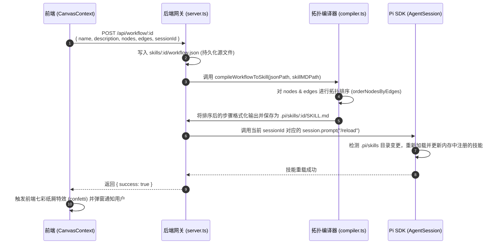
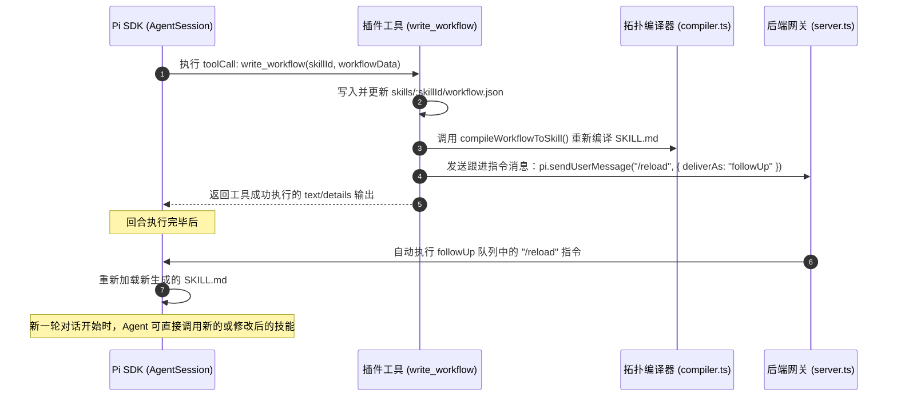
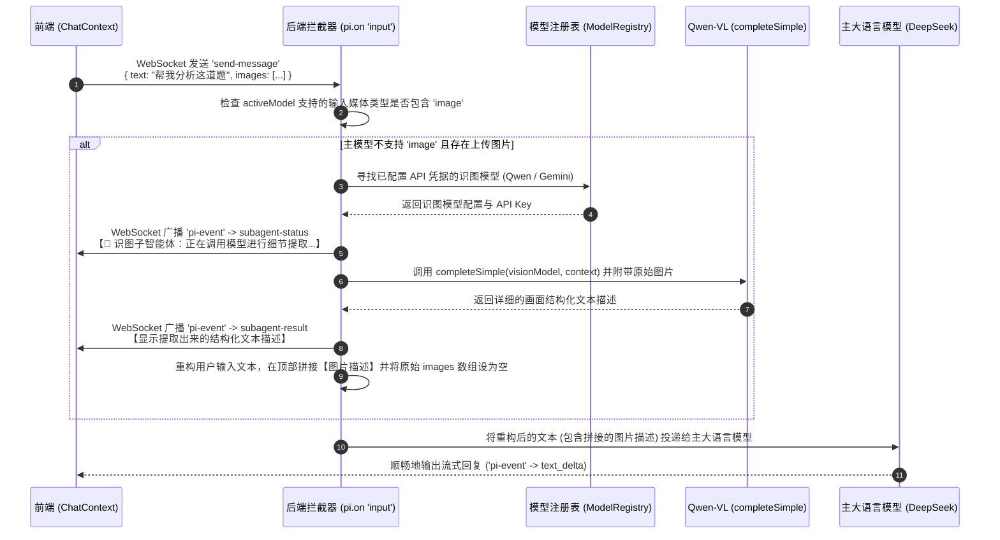

# projectEL 开发者架构与技术栈说明书

本指南面向 `projectEL` 系统的日常维护与二次开发人员，旨在详细阐述系统的技术栈配置、微架构交互时序、数据通信协议、运行时目录结构，以及本地联调与环境排错指南。

---

## 1. 技术栈详解

项目采用 **Monorepo** 架构，利用 `npm workspaces` 统一进行前端、后端及 `pi-sdk` 本地开发包的多包依赖与编译管理。

### 1.1 依赖架构大观

| 模块 | 技术 / 依赖库 | 核心作用与版本 | 配置文件 |
| :--- | :--- | :--- | :--- |
| **Monorepo 容器** | Node.js (>=18.0.0)<br>npm workspaces | 统一管理子包，免去本地多包发布，建立包内本地软链接 | [package.json (Root)](file:///c:/Users/lisky/Desktop/projectEL/package.json) |
| **前端服务 (frontend)** | React (v18)<br>Vite<br>TypeScript<br>@xyflow/react (v12)<br>Socket.io Client (v4)<br>Lucide React | 前端视图层，高响应的画布及聊天交互；采用 Vite 作为极速构建工具；利用 React Flow 绘制拓扑节点图谱；Socket.io 进行实时双向长连接通信。 | [package.json (Frontend)](file:///c:/Users/lisky/Desktop/projectEL/frontend/package.json) |
| **后端网关 (backend)** | Node.js Express<br>Socket.io Server (v4)<br>fs-extra<br>tsx watch<br>Typebox | 提供 16 个 REST API 端点；通过 WebSocket 管理流式消息广播；使用 `tsx watch` 在开发阶段自动热重启服务；使用 Typebox 对输入参数执行强类型约束。 | [package.json (Backend)](file:///c:/Users/lisky/Desktop/projectEL/backend/package.json) |
| **内核 SDK (pi-sdk)** | `@earendil-works/` 包 | `@earendil-works/pi-agent`：Pi Agent 主生命周期与运行时管理器。<br>`@earendil-works/pi-ai`：统一的多供应商大模型适配器（支持 completeSimple 等）。<br>`@earendil-works/pi-coding-agent`：提供本地文件、命令行工具链与系统扩展 API。 | [pi-sdk](file:///c:/Users/lisky/Desktop/projectEL/pi-sdk) |

---

## 2. 目录与运行时结构

### 2.1 Monorepo 物理结构

```
projectEL/
├── package.json                          # Monorepo 根配置与 npm workspaces 定义
├── tsconfig.base.json                    # 共享的 TypeScript 基础配置
├── start.bat                             # Windows 一键自诊断与双端启动脚本
├── backend/                              # Express 后端服务子工程
│   ├── package.json
│   └── src/
│       ├── server.ts                     # WebSocket/HTTP 网关、Pi Session 管理
│       ├── compiler.ts                   # 拓扑排序：JSON 工作流 -> SKILL.md 编译器
│       ├── study-agent-extension.ts      # Pi 扩展（指令注入、Qwen 拦截器、write_workflow）
│       └── knowledge-base/               # 遗忘曲线知识库引擎与 REST 路由
├── frontend/                             # Vite + React 前端子工程
│   ├── package.json
│   └── src/
│       ├── App.tsx                       # 全局 Context 挂载与卡片总视图
│       ├── contexts/                     # 状态解耦层（Chat, Workspace, Canvas Context）
│       └── components/                   # 各卡片 UI 呈现（ChatCard, CanvasCard, KnowledgeCard）
├── wiki_core/                            # L3 知识库数据存储目录（按 Markdown 格式分类）
│   ├── concepts/                         # immortal 与 standard 状态的概念卡片
│   ├── temporary/                        # decay_fast 状态的临时速记卡片
│   └── archive/                          # 置信度过低归档后的冷数据归档区
├── curated_notes/                        # L2 知识库：供 SM-2 复习的笔记目录
├── sources/                              # L1 知识库：只读的外部源材料
├── inbox/                                # 暂存区目录，存放生成的 archive_review.md
├── skills/                               # 前后端共享的工作流源配置文件与智能体预设
│   └── agent-presets.json                # 预设配置文件（苏格拉底导师、代码专家等）
└── .pi/                                  # Pi Agent SDK 运行时目录（自动生成）
```

### 2.2 `.pi/` 运行时目录深度剖析

`.pi/` 目录是 Pi SDK 在运行时存放配置、状态、动态热加载扩展和技能的隔离空间，由后端 [server.ts](file:///c:/Users/lisky/Desktop/projectEL/backend/src/server.ts) 自动初始化和维护。

```
.pi/
├── auth.json                             # 供应商 API 凭证存储文件（WebUI 设置面板一键保存）
├── models.json                           # 用户自定义和启用的模型列表与供应商 Base URL
├── skills/                               # 动态编译出的 SKILL.md 文件夹
│   └── [skillId]/
│       └── SKILL.md                      # compiler.ts 编译出供 Pi SDK 加载的技能定义
├── extensions/                           # 运行时加载的扩展脚本
│   ├── study-agent-extension.ts          # 由后端启动时自动自 backend/ 拷贝而来，挂载拦截器
│   └── compiler.ts                       # 扩展的依赖库
└── agent/
    └── sessions/                         # 聊天会话的本地持久化历史
        └── session_[timestamp]_[sessionId].jsonl # JSONL 行格式的会话行为事件审计日志
```

> [!IMPORTANT]
> **运行时同步机制**：为了能够使 Pi 内核加载本地开发的扩展，[server.ts](file:///c:/Users/lisky/Desktop/projectEL/backend/src/server.ts) 在启动时会自动使用 `fs.copy` 将最新的 [study-agent-extension.ts](file:///c:/Users/lisky/Desktop/projectEL/backend/src/study-agent-extension.ts) 强制覆盖拷贝到 `.pi/extensions/` 中。**切勿直接修改 `.pi/extensions/` 下的代码，所有开发更改应当在 `backend/src/` 中完成。**

---

## 3. 微架构设计与时序关系

### 3.1 A环：工作流可视化保存与内核热重载

当用户在前端 Canvas 可视化界面修改并点击“保存并编译工作流”时，时序交互如下：



### 3.2 B环：智能体自我修饰与反向技能演化

当主智能体决定在执行任务期间修改或创建可视化技能时，时序交互如下：



### 3.3 多模态识图与 Qwen-VL 子智能体拦截机制

当用户上传图片但当前主模型（例如 DeepSeek 纯文本模型）不支持视觉输入时，`input` 拦截器将自动介入：



---

## 4. 接口协议与通信定义

### 4.1 HTTP REST 接口设计

所有 HTTP 接口的 Base URL 为 `http://localhost:3000`。

#### 4.1.1 会话管理

*   **`GET /api/sessions`**
    *   **作用**：获取所有会话列表。
    *   **返回参数**：
        ```json
        {
          "sessions": [
            { "id": "default-session", "name": "C++ STL 探讨", "preset": { "id": "socrates", "name": "苏格拉底导师" }, "createdAt": "...", "modifiedAt": "...", "messageCount": 5 }
          ]
        }
        ```
*   **`POST /api/sessions/create`**
    *   **作用**：基于预设或空白状态创建新会话。
    *   **请求体**：`{ "presetId": "socrates", "sessionId": "optional-uuid" }`
    *   **返回参数**：`{ "success": true, "sessionId": "...", "presetId": "...", "model": "...", "thinkingLevel": "..." }`
*   **`POST /api/sessions/switch`**
    *   **作用**：切换当前激活的会话。
    *   **请求体**：`{ "sessionId": "..." }`
*   **`DELETE /api/sessions/:id`**
    *   **作用**：彻底删除本地持久化会话日志。**注意：`default-session` 不允许删除**。

#### 4.1.2 模型管理

*   **`GET /api/models`**
    *   **作用**：查询各大模型供应商的 API Key 配置状态、可用模型列表及当前会话使用的模型。
*   **`POST /api/models/configure`**
    *   **作用**：配置某个 Provider 的 Base URL、API 凭证和自定义模型映射。
    *   **请求体**：
        ```json
        { "provider": "deepseek", "apiKey": "sk-...", "baseUrl": "https://api.deepseek.com", "models": [...] }
        ```
*   **`POST /api/models/select`**
    *   **作用**：为会话选择大模型与思维深度（思考等级）。
    *   **请求体**：`{ "provider": "deepseek", "modelId": "deepseek-reasoning", "thinkingLevel": "high", "sessionId": "..." }`

#### 4.1.3 知识库（双轨记忆系统）

*   **`GET /api/knowledge/cards`**：列出当前所有的 Wiki 卡片（计算出有效置信度并降序排序）。
*   **`POST /api/knowledge/cards`**：创建新的 Wiki 卡片（默认初始置信度 $0.8$）。
*   **`PUT /api/knowledge/cards/:id`**：更新卡片（可修改标题、内容、Lifecycle 等，同时更新 `last_interacted` 触发新一周期衰减）。
*   **`POST /api/knowledge/cards/:id/boost`**：对卡片执行 Boost 增强操作，提升置信度 $0.2$。
*   **`POST /api/knowledge/notes/:id/review`**：对 Layer 2 复习卡片进行 SM-2 评分复习（传入评分 `grade` 为 0-4）。
*   **`POST /api/knowledge/archive/lint`**：扫描置信度低于 $0.15$ 的卡片，在 `inbox/` 目录下刷新输出并生成 `archive_review.md`。
*   **`POST /api/knowledge/archive/execute`**：正式执行归档。移动文件到 `wiki_core/archive/`，并行使正则搜索，重写系统内所有引用的 `[[双链]]` 为 `**概念名[已归档]**`。

---

### 4.2 WebSocket (Socket.io) 实时通信协议

客户端通过 Socket.io 与 `http://localhost:3000` 连接，所有的长连接消息由房间 `sessionId` 隔离。

#### 4.2.1 客户端投递事件 (Client -> Server)

| 事件名 | 载荷格式 | 说明 |
| :--- | :--- | :--- |
| **`join-session`** | `{ sessionId: string }` | 客户端切换或加入房间。服务端会立即回复当前房间的完整历史状态 `session-state`。 |
| **`leave-session`** | `{ sessionId: string }` | 退出特定房间，停止监听该房间的流式输出。 |
| **`send-message`** | `{ text: string, images?: Array<{ data: string, mimeType: string }>, sessionId: string }` | 发送用户提问，包含图片数据。 |
| **`abort`** | `{ sessionId: string }` | 中断当前正在处于流式推理的智能体会话。 |
| **`clear-session`** | `{ sessionId: string }` | 清空当前会话的上下文消息链，开始新会话。 |

#### 4.2.2 服务端推送事件 (Server -> Client)

| 事件名 | 载荷格式及关键字段 | 说明 |
| :--- | :--- | :--- |
| **`session-state`** | `{ model: string, thinkingLevel: string, messages: ChatMessage[] }` | 房间状态完整同步事件。用于客户端初连、重连或切换会话时的视图初始化。 |
| **`pi-event`** | `{ type: string, ... }` | **Pi 核心流式推送**：<br>- `agent_start`: 开始运行 Agent 轮次。<br>- `agent_end`: 本回合运行完成。<br>- `message_start`: 新消息容器生成。<br>- `message_update` & `text_delta`: 大模型流式输出字符增量。<br>- `tool_execution_start`/`end`: 调用本地工具执行（如 run_bash）。 |
| **`pi-error`** | `{ message: string }` | Pi 内核系统级异常广播。 |

---

## 5. 本地调试与排错指南

### 5.1 环境配置

系统主要通过环境变量或 `.pi/auth.json` 两种形式加载各个大模型供应商的 API 凭证。

```bash
# 环境变量配置示例 (可以在系统属性或 Windows cmd 中设置)
set DEEPSEEK_API_KEY=sk-deepseekxxxxxxxxxx
set DASHSCOPE_API_KEY=sk-qwenxxxxxxxxxxxxxxxx
```

> [!WARNING]
> **代理 Key 过滤检测**：[start.bat](file:///c:/Users/lisky/Desktop/projectEL/start.bat) 自诊断脚本会在检测到环境变量中包含 `sk-ant-router` 时，识别出该 Key 为本地编码工具的代理 Key，为了防止大模型适配器报错，脚本会**主动过滤并废弃**该环境变量配置，优先使用 `.pi/auth.json` 内配置的 API 密钥。

### 5.2 常见故障与排错

#### 5.2.1 故障 1：WebSocket 连接失败或网络卡在 "获取中..."
*   **现象**：Web 界面消息发送后没有反应，右上角模型显示 "获取中..."，控制台报错连接超时。
*   **原因分析**：
    1. 后端 Express/Socket 端口已被其他进程占用（默认 3000 端口）。
    2. 前端请求的 `localhost:3000` 域名由于本地 hosts 配置被 IPv6 的 `::1` 拦截，而 Express 服务仅绑定在 `127.0.0.1` 导致跨域。
*   **排查与解决办法**：
    - 在命令行输入 `netstat -ano | findstr 3000` 检查端口占用，使用 `taskkill /F /PID <PID>` 释放端口。
    - 检查 frontend 中 [ChatContext.tsx](file:///c:/Users/lisky/Desktop/projectEL/frontend/src/contexts/ChatContext.tsx#L129) 连接地址，如有需要，可修改为具体的 IP 地址 `127.0.0.1:3000`。

#### 5.2.2 故障 2：多模态识图报错 `DashScope api_key is invalid` 或找不到授权模型
*   **现象**：用户上传图片后，识图子智能体状态栏显示红色错误，后台报错。
*   **原因分析**：
    1. 阿里百炼平台（DashScope）与阿里云账号存在双重空间概念。在“百炼大模型平台”上获取的 Key 默认没有激活所有通义千问模型的 API 授权。
*   **排查与解决办法**：
    - 开发者需登录 [阿里云百炼控制台](https://bailian.console.aliyun.com/)。
    - 导航至 **业务空间 -> 模型广场**，手动搜索所需的识图模型（如 `qwen3.6-flash` 或 `qwen-vl-max`），点击 **“开启授权”**。若未激活授权，即使 API Key 校验通过，直接调用依然会返回错误。

#### 5.2.3 故障 3：修改扩展插件 `study-agent-extension.ts` 后代码不生效
*   **现象**：修改了 [study-agent-extension.ts](file:///c:/Users/lisky/Desktop/projectEL/backend/src/study-agent-extension.ts) 中的拦截器代码（如注入逻辑），但是运行中行为没有任何改变。
*   **原因分析**：
    - Pi SDK 底层在加载 Extension 路径时，读取的是 `.pi/extensions/` 运行时目录下的副本，而不是 `backend/src/` 中的源码。
*   **排查与解决办法**：
    - 每次修改源码后，必须**重新启动后端服务**，[server.ts](file:///c:/Users/lisky/Desktop/projectEL/backend/src/server.ts#L41) 会在重新握手时自动将新源码打包拷贝至运行时副本。
    - 如果需要实现热修改，可以运行 `npm run dev` 启动，底层热更新监听器会实时编译并重新注入加载。
