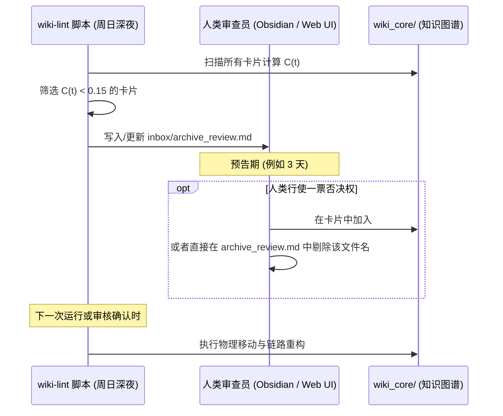

# 🚀 智能融合知识库架构白皮书（V2 遗忘曲线与常青盾牌版）

本架构在 V1 基础上，深度集成了 **LLM Wiki v2 的时间维度管理（遗忘曲线）**，并对**人类大脑记忆**与**LLM 知识检索**分别定制了独立的退化与唤醒算法。同时，引入了 **“人类常青锁（Immortal Lock）”** 机制，确保底层公理、核心 SOP 等经典知识永不退化。

---

## 🗺️ V2 核心架构总览 / Layer Architecture

```text
========================================================================================
【第 1 层：不可变原始资料 / LAYER 1: IMMUTABLE RAW SOURCES】
========================================================================================
  [经典教材/论文/Bug记录] ──> 放入 sources/ 文件夹 (人类不读，LLM 只读不改)
                                │
                                ▼
========================================================================================
【第 2 层：人类阅读与精简层 / LAYER 2: HUMAN READABLE & CURATED MD】 🌟 遗忘控制沙盒 🌟
========================================================================================
  📂 inbox/ 或 curated_notes/ (由人类创建/审核，或由 LLM 生成供人类阅读的单篇摘要)
  ├── 📄 经典教材_概率论.md   <── [打上 #permanent 标签] ──> 【🔒 常青锁定，永不退化】
  └── 📄 临时Bug_0524.md    <── [打上 #transient 标签] ──> 【⏳ 触发人类/LLM 双重衰减曲线】
                                │
                                ▼ 触发编译 / Ingest Trigger
========================================================================================
【第 3 层：LLM 动态编译知识网 / LAYER 3: LLM COMPILED WIKI NETWORK】 (置信度与动态生命周期)
========================================================================================
  📂 wiki_core/ (由 LLM 控制，在 YAML 元数据中维护生命周期)
  ├── 📂 concepts/  ──> [[贝叶斯定理.md]] ──> (Confidence: 1.0, Profile: Immortal 🔒)
  └── 📂 temporary/ ──> [[Docker冲突.md]] ──> (Confidence: 0.2, 衰减中... 📉)
                                │
                                ▼ 
========================================================================================
【第 4 层：最终消费与低噪检索 / LAYER 4: CONSUMPTION & INTERACTION】
========================================================================================
  💻 人类在 Obsidian 中提问，AI 优先检索“高置信度”与“常青”知识，自动忽略置信度过低的“过期杂音”。
```

---

## 🛠️ “遗忘与常青”核心实现机制

在入库与编译（Layer 2 -> Layer 3）阶段，系统会读取笔记顶部的 **YAML 元数据（Frontmatter）** 属性。

### 1. 人类入库时的三种指令配置（YAML 示例）

#### 🔒 A. 常青/永生型（如教材、核心公理、公司愿景）
打上 `#permanent` 标签或显式声明 `lifecycle: immortal`。
```markdown
---
title: 线性代数核心定理
tags: [数学, #permanent]
lifecycle: immortal
---
```
* **编译行为**：LLM 强行将衰减率 $\lambda$ 设为 `0`，置信度永远维持在 `1.0`，不受时间衰减影响。

#### ⏳ B. 标准知识型（如前沿技术论文、行业报告）
默认状态，无需特殊标记，声明为 `lifecycle: standard`。
```markdown
---
title: Qwen-2.5 架构分析
lifecycle: standard
---
```
* **编译行为**：采用标准衰减参数，随时间缓慢衰减（半衰期约 180 天），通过使用和引用获得置信度回升。

#### ⚡ C. 临时/高危型（如临时 Bug 排查、特定版本的 API 规则）
打上 `#transient` 标签或显式声明 `lifecycle: decay_fast`。
```markdown
---
title: 2026-05 微信SDK支付接口报错
tags: [#transient]
lifecycle: decay_fast
---
```
* **编译行为**：分配极高的衰减率（半衰期约 14 天），若两周内无互动，置信度会迅速跌落至归档线。

---

## 📈 双轨遗忘曲线模型设计

系统针对**人类记忆规律（Layer 2）**与**LLM 知识时效（Layer 3）**分别采用了不同的数学模型：

### 1. 人类记忆侧：SM-2 / FSRS 间隔重复算法 (Layer 2)
为了帮助人类抗击遗忘，`inbox/` 与 `curated_notes/` 中的笔记元数据中直接固化间隔重复状态参数。这与 Obsidian 等软件的 Spaced Repetition 插件完美兼容。

#### 📝 YAML 存储格式
```markdown
---
next_review: 2026-05-30T09:00:00 # 下一次复习时间
stability: 5                     # 记忆稳定性（天数间隔）
difficulty: 3                    # 记忆难度
reps: 2                          # 已复习次数
---
```
* **复习更新机制**：
  每次人类复习后反馈评级（1=忘光，2=困难，3=良好，4=简单），算法据此调整 `stability` 和 `difficulty`，重新计算并写入 `next_review`。

---

### 2. LLM 知识侧：指数衰减模型 (Layer 3)
LLM 编译出的 Wiki 概念卡片（`wiki_core/` 目录）的置信度 $C(t)$ 随时间呈指数下降，公式如下：

$$C(t) = C_0 \cdot e^{-\lambda \cdot t}$$

其中：
* $C_0$：上一次交互/更新后的初始置信度。
* $t$：距离上一次交互或验证流逝的天数。
* $\lambda$：衰减常数，由知识的 `lifecycle` 决定：
  * **Immortal**：$\lambda = 0$（置信度永远为 $1.0$）
  * **Standard**：$\lambda \approx 0.0038$（半衰期 $T_{half} = 180$ 天）
  * **Decay Fast**：$\lambda \approx 0.0495$（半衰期 $T_{half} = 14$ 天）

#### 📝 YAML 存储格式
```markdown
---
confidence_score: 0.85
last_interacted: 2026-05-20T12:00:00
decay_rate: 0.0038
---
```

---

## 🔄 置信度增量回升模型 (Incremental Boost)

为了防止偶发检索将已接近遗忘的垃圾知识瞬间复活，系统摒弃了“一触即回满”的简单逻辑，采用**增量提升模型**：

每次该知识节点在会话中被 **检索、引用或新资料印证** 时，其置信度按下式更新：

$$C_{new} = \min(1.0, C_{current} + \Delta)$$

* **增量设定**：$\Delta = 0.2$。
* **物理意义**：一个几乎被淡忘的知识点（如置信度 $0.2$），需要至少被连续有效引用 $4$ 次以上，才能重新恢复至满额置信度（$1.0$）。这能有效过滤单次偶然提问带来的噪声干扰。

---

## 🗑️ 物理隔离与链路重构归档策略 (Archiving Strategy)

当节点的置信度 $C(t)$ 跌破 **归档阈值（$\text{Threshold} = 0.15$）** 时，系统会执行归档流程，避免对活动图谱造成干扰。

### 1. 物理隔离
* 文件由 `wiki_core/concepts/` 或 `wiki_core/temporary/` 物理移动至 `wiki_core/archive/` 目录下。

### 2. 链路重构
为了消除 Obsidian 等双向链接图谱中的“悬空断链/死链”，系统会自动扫描所有未归档文件，重写指向已归档节点的链接：
* **转换前**：`请参考 [[Docker冲突]] 了解详情。`
* **转换后**：`请参考 **Docker冲突[已归档]** 了解详情。` （双链语法降级为普通加粗文本，并标注状态）

---

## 🗓️ 每周“预告审查（Veto Review）”大扫除工作流

系统通过 `wiki-lint` 脚本实现每周自动清理，并赋予人类“一票否决权”以保证掌控感：



### 3.1 审查清单文件设计 (`inbox/archive_review.md`)
每次扫描后，系统在 `inbox/` 目录下创建/追加如下格式的文档：

```markdown
# 🧹 知识库归档预告清单（生成时间：2026-05-24）

以下知识节点置信度已低于 0.15。如果在下一次清理周期前未被“否决”，系统将自动将其移入 `wiki_core/archive/` 并重构引用链路。

## 拟归档文件列表 (编辑此列表删除某行即可否决归档)

- [ ] [Docker冲突.md](file:///wiki_core/temporary/Docker冲突.md) (置信度: 0.12)
- [ ] [微信旧版接口_2025.md](file:///wiki_core/temporary/微信旧版接口_2025.md) (置信度: 0.08)

---
> 💡 **如何恢复/锁定？**
> 1. 在当前文档中勾选/删除对应行以行使一票否决权。
> 2. 或直接打开对应的笔记，在元数据中将 `lifecycle` 修改为 `immortal`。
```

---

## 💎 V2 核心优势

1. **双轨并行**：人类依靠主动复习（SM-2）加深记忆，LLM 依靠时间半衰期（Exponential Decay）自动降噪，二者互不干扰且完美流转。
2. **渐进式唤醒**：引入 `+0.2` 增量提升，防范过期或低频干扰知识因偶发检索而意外“死灰复燃”。
3. **安全归档链路**：物理移动搭配智能链路降级重构，确保 Obsidian 关系图谱干净无断链。
4. **人类掌控权**：通过 `archive_review.md` 进行预告，将最终决定权百分之百留给人类。
