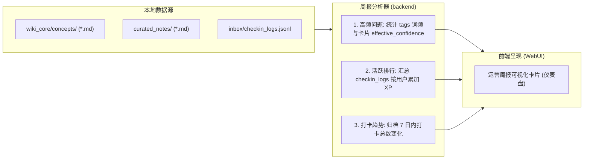

# projectEL × NapCat OneBot v11 开源智能助教系统开发建议报告 (公式与运营周报强化版)

本报告详细说明了如何将 `projectEL` 的核心能力与 **NapCat OneBot v11 (QQ 机器人协议端)** 开源架构整合，打造一款面向个人及学习社群的纯开源辅助学习助教系统。系统完全去除了所有商业化限制，聚焦于**开源共享、无缝嵌入、自生长学习知识网**三大核心原则。

同时，为了支持**双边服务模式**，系统不仅在 QQ 群内辅助群成员学习，还为群主在 WebUI 后端管理面板中提供**自动化群运营周报**（包含高频问题、活跃排行和打卡趋势），其数据源完全由本地知识库底座驱动。

---

## 一、 系统集成架构设计

系统继续沿用轻量、无需公网端口暴露的**反向 WebSocket 客户端 (Reverse WebSocket Client)** 模式对接。

### 1.1 拓扑图与消息分发流

```mermaid
graph TD
    %% 外部平台
    QQ[QQ 客户端 / 群聊终端] <-->|OneBot v11 协议包| NC[NapCat OneBot v11 本地容器]
    
    %% 本地服务
    subgraph projectEL_Backend ["projectEL 后端网关 (Node.js)"]
        QA[qq-adapter.ts] <-->|反向 WS 连接| NC
        
        %% 格式化组件
        QA -->|发送前格式化判断| Router{消息内容包含公式?}
        Router -->|是: 提取并渲染| Render[Puppeteer 浏览器渲染引擎]
        Router -->|否: 转换纯文本| Formatter[Markdown-to-PlainText 转换器]
        
        Render -->|输出 PNG 图片卡片| NC
        Formatter -->|输出 emoji 序号排版文本| NC
        
        Agent[Pi AgentSession] <-->|流式响应监听| QA
        
        %% 运营统计组件
        KB[knowledge-base-service.ts] <-->|记录答卷与打卡数据| QA
        KB -->|自动聚类高频概念| ReportGen[运营周报生成器]
    end

    subgraph projectEL_Frontend ["projectEL 前端管理面板 (Vite)"]
        UI[QQ 机器人监控卡片] <-->|Socket.io| Svr
        WebUI[群主运营周报 WebUI 卡片] <-->|HTTP GET /api/knowledge/weekly-report| Svr
    end

    subgraph Storage ["本地数据目录"]
        Wiki[wiki_core/concepts/ (Markdown 概念卡片)]
        Notes[curated_notes/ (SM-2 笔记)]
        Sources[sources/ (群文件源材料)]
        Logs[inbox/checkin_logs.jsonl (答题打卡日志)]
    end

    QA -->|自动同步群文件| Sources
    QA -->|指令触发保存对话| Inbox
    ReportGen -->|读取统计分析| Storage
```

---

## 二、 双边服务模式：群主自动化运营周报设计

系统建立在**知识库数据溯源**的基础上，通过抓取和分析群内的打卡答题记录、知识库卡片属性，为群主在 WebUI 中提供直观的社群画像。

### 2.1 核心周报数据模型与提取机制

每周报的数据全部由本地文件系统提取并持久化：



#### 1. 高频问题 (High-Frequency Hotspots)
*   **计算逻辑**：分析 [wiki_core/concepts/](file:///c:/Users/lisky/Desktop/projectEL/wiki_core/concepts/) 目录中卡片 frontmatter 的 `tags` 命中频率，并提取其中有效置信度 `effective_confidence` 衰减最快（代表群员最容易遗忘/提问最多）的前 5 个技术标签或概念。
*   **作用**：群主可以直观看出群内近期讨论最激烈、最薄弱的知识模块是哪些。

#### 2. 活跃排行 (Active Leaderboard)
*   **计算逻辑**：解析每次用户答题的日志文件 `inbox/checkin_logs.jsonl`，汇总 7 日内各 QQ 用户（`user_id`）的答题总次数、正确率及累加的 XP 积分，输出前 10 名的排行榜。
*   **作用**：辅助群主发放社群福利或识别群活跃分子。

#### 3. 打卡趋势 (Check-In Trends)
*   **计算逻辑**：对 `inbox/checkin_logs.jsonl` 中近 7 日的打卡戳记按天归类，统计每天成功答题的人次和失败人次。
*   **作用**：群主可监控群聊在周一至周日期间活跃度的上下波动，及时调整运营节奏。

---

## 三、 QQ 终端多模态内容渲染引擎

由于官方 QQ 客户端不支持 Markdown 及 LaTeX 排版，系统在 [qq-adapter.ts](file:///c:/Users/lisky/Desktop/projectEL/backend/src/qq-adapter.ts) 发送响应前，通过核心路由器对输出内容进行多轨并行格式化：

### 3.1 轨道 A：严密数学公式卡片渲染 (Puppeteer)

当 AI 助教生成的解答中包含复杂的 LaTeX 公式区块（如 `$$...$$` 或 `$...$`）时，系统自动切换为**无头浏览器渲染**轨道。
*   将 Markdown 动态注入预设 KaTeX 的 HTML/CSS 模板中，由 Puppeteer 网页截图生成精美 PNG，通过 `[CQ:image...]` CQ 码发送。

### 3.2 轨道 B：非 Markdown 富文本讲解转换器 (Markdown-to-PlainText)

若 AI 回答为常规大纲、步骤，则执行 Markdown 语法滤除：
*   标题 `#` 滤除为 `📌 标题`
*   列表 `-` 滤除为数字 Emojis `1️⃣` / `2️⃣`
*   粗体 `**` 转换为 `【】`
*   增加首行双空格缩进，实现 QQ 气泡框最佳无损排版。

---

## 四、 开源 Skill 提纯与双链工作流

群聊中沉淀的文本将触发专属的 **`chat-refiner`** 技能，清洗水群噪音并生成双链卡片：
*   **步骤 1 (LLM)**：自动分析 inbox 沉淀 of 群聊片段，滤除无价值信息，归纳核心知识概念并生成 JSON 卡片数据。
*   **步骤 2 (LLM)**：运行双链提取器，识别概念关联并重塑 `[[双链]]` 引用。
*   **步骤 3 (Write File)**：自动将 Markdown 卡片持久化写入 `wiki_core/concepts/`。
